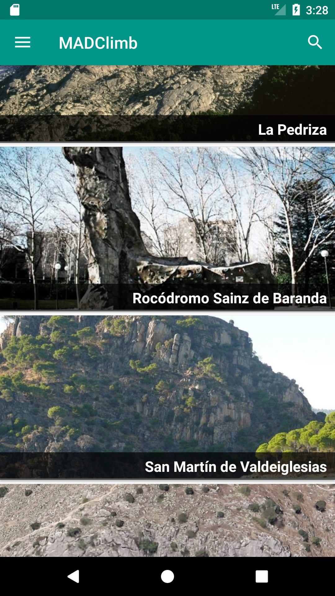
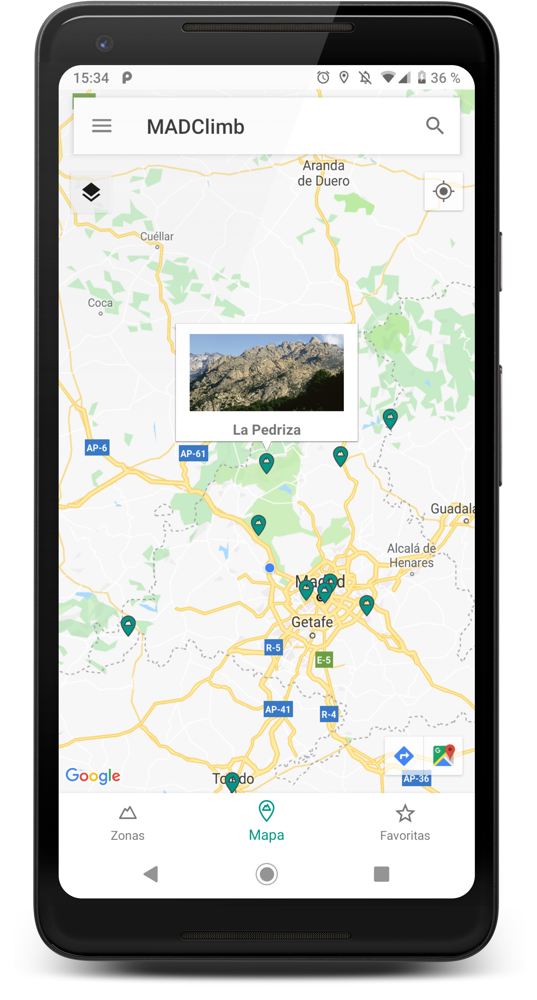
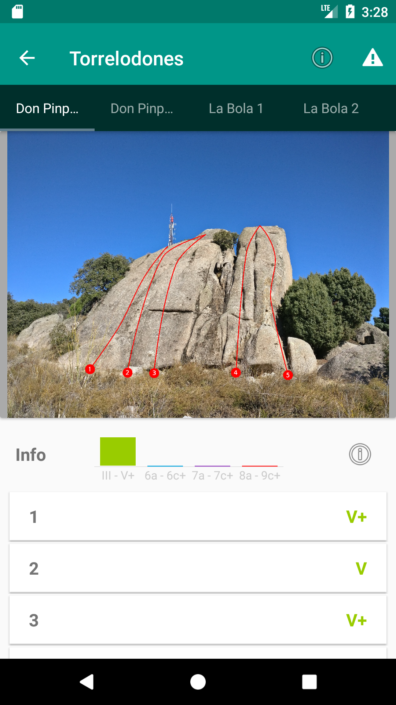
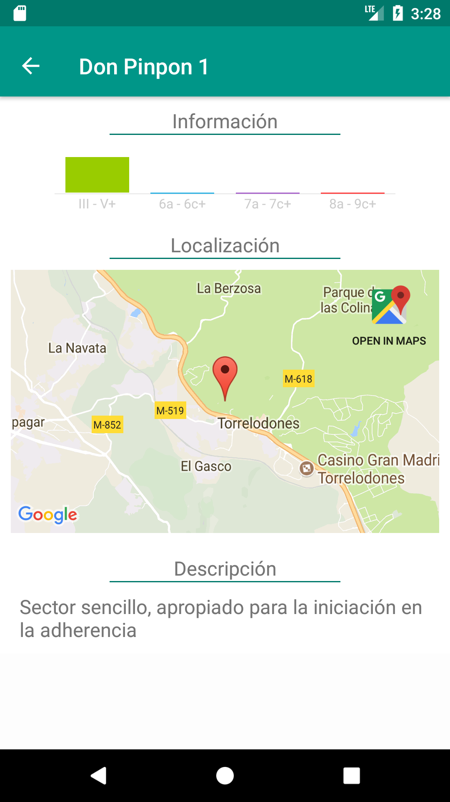

# MADClimb

      

MADClimb es una app de croquis para escalada en los alrededores de Madrid. Perfecta para encontrar nuevas vías y para redescubrir los sectores de siempre.
La aplicación muestra los sectores y las vías de múltiples zonas de escalada, con croquis actualizados y un sencillo buscador.
La base de datos es actualizada constantemente, añadiendo nuevas zonas e informando sobre problemas y cambios en las incluidas.

MADClimb es completamente gratuita, sin anuncios, y es software libre. 
-Si encuentras algún problema con la app, errores, datos erroneos o tienes algo que comentar: madclimbapp@gmail.com  
-Si quieres contribuir a la base de datos de la aplicación, no dudes en contactar con madclimbapp@gmail.com. Si tienes una buena foto de algún sector, envíanosla!  
-Si quieres contribuir al desarrollo, el código está en github: https://github.com/kleiren/MADClimb 

Esto es un proyecto de una sóla persona. Lo realizo en mi tiempo libre y no puedo dedicarle todo el tiempo que querría. No seas impaciente si la aplicación da problemas o no tiene suficiente contenido.

# TODO
- Añadir comentarios en sectores 
- Añadir apartados de zonas y sectores favoritos 
- Permitir búsqueda de sectores y vías además de zonas 
- Mostrar todos los sectores en el mapa de la zona 
- Añadir información de horas de sol 
- Añadir usuarios y puntuaciones a las vías 
- Refactorizar a MVP para facilitar tests y la adición de funcionalidades 
